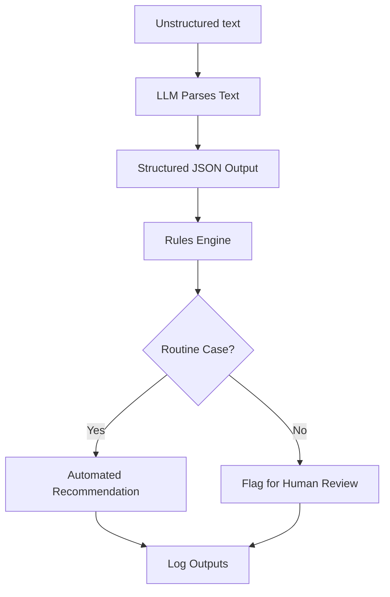

### Title: Colonoscopy Surveillance Triage Automation Tool

### Short Description: 

A backend service that converts unstructured colonoscopy and histopathology reports into guielines-based surveilance recommendations, automating routine follow-up tasks while keeping humans in the loop

### 1. Problem:
Manual review of histopathology reports to determine surveillance intervals is a time-consuming and error-prone process requiring significant clinician time and effort.  The current workflow depends heavily on manual look-ups and paper records.

### 2. Solution:
This system:
* Parses free text into strutured JSON using an LLM to process free text
* Applies current guidelines in a deterministic, rules-based process
* Automates roughly 80% of cases, flagging complex or ambiguous cases for human review
* Logs all inputs and outputs for auditing and quality control
Key principles:
* Human-in-the-loop design
* Deterministic and rule-based using current guidelines
* LLM DOES NOT make any clinical decisions or recommendations

### 3. Architecture:
Workflow:

Stack:
* Python, FastAPI
* Docker for containerization and deployment
* Hosted on Azure
* Basic UI (React/Typescript) in a separate repo for manual data entry

### 4. Impact:
* Reduces manual copying of patient data on paper forms
* Reduces time spent by physicians and nurses on routine cases reserving this valuable resource for complex cases
* Standardizes triaging process and clinical workflow

### 5. How to run:
* Clone the repo
* Build docker container
* Configure environment variables -
    - OpenAI API key - to initialize the chat client (can be OpenAI or AzureOpenAI)
    - OpenAI API version
    - OpenAI API endpoint
    - HMAC key (keyed hashing for deidentification)

